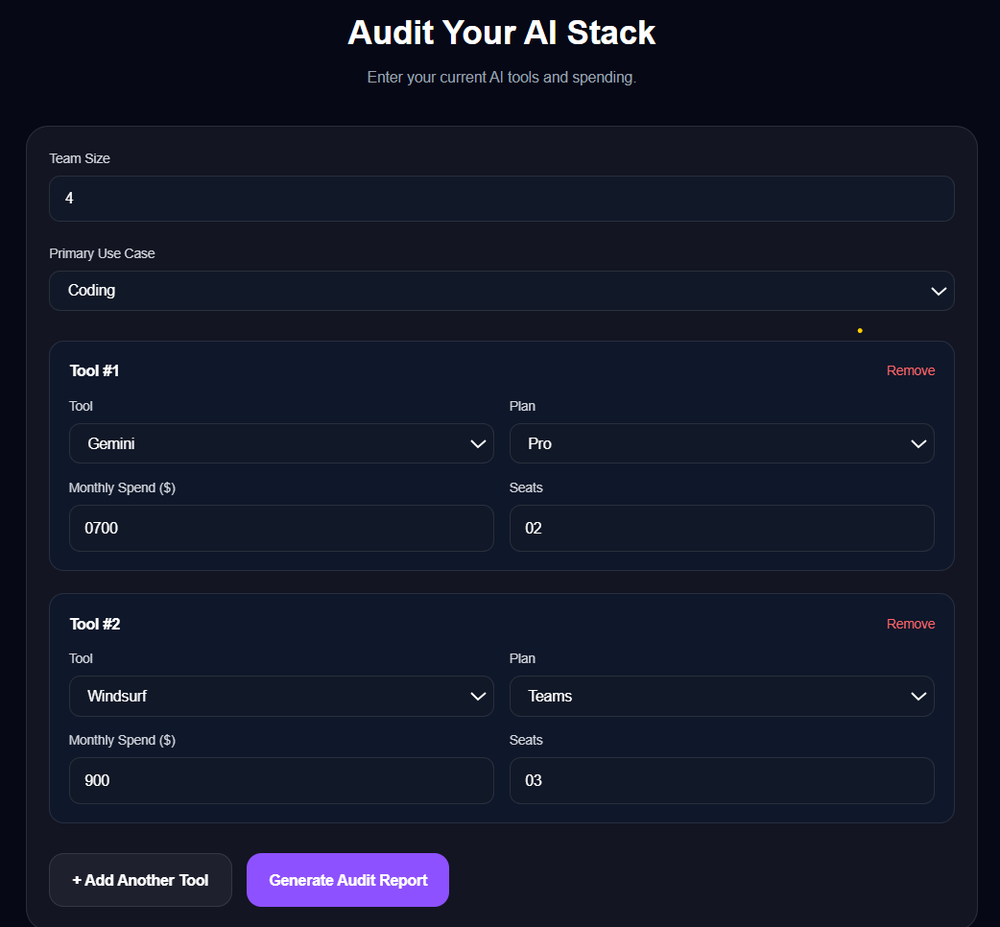
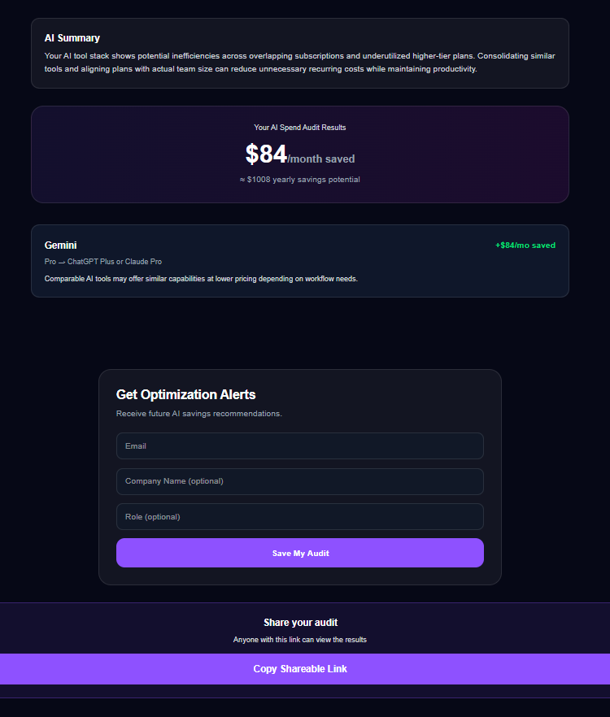

# README.md

# LedgerLoop

LedgerLoop is an AI spend optimization platform that helps teams analyze their AI tooling costs and discover potential savings opportunities. Users can audit tools like Cursor, ChatGPT, Claude, GitHub Copilot, and Gemini, generate AI-powered optimization recommendations, and share audit reports using public links.

The platform is designed for startups, developers, and modern teams that use multiple AI subscriptions and want better visibility into AI spending.

# Features

* AI stack audit form
* Cost-saving recommendation engine
* AI-generated optimization summaries
* Shareable public audit reports
* Lead capture system
* Rate limiting + spam protection
* Supabase database integration
* Responsive modern UI

# Screenshots / Demo

Add screenshots here:

## Audit Form



## Audit Results



## Shared Audit Report


OR add a Loom/YouTube demo link:

Demo Video: https://your-demo-link.com

# Quick Start

## 1. Clone Repository

```bash
git clone https://github.com/sanika12w/ledgerloop
cd ledgerloop
```

## 2. Install Dependencies

```bash
npm install
```

## 3. Configure Environment Variables

Create a `.env.local` file:

```env
NEXT_PUBLIC_SUPABASE_URL=YOUR_SUPABASE_URL
NEXT_PUBLIC_SUPABASE_ANON_KEY=YOUR_SUPABASE_ANON_KEY
SUPABASE_SERVICE_ROLE_KEY=YOUR_SERVICE_ROLE_KEY
OPENAI_API_KEY=YOUR_OPENAI_KEY
RESEND_API_KEY=YOUR_RESEND_KEY
```

## 4. Run Locally

```bash
npm run dev
```

Open:

```text
http://localhost:3000
```

# Deployment

The application is deployed using Vercel.

Production URL:

https://your-vercel-url.vercel.app

# Decisions & Trade-offs

## 1. Used deterministic savings logic instead of full AI analysis

This ensured faster responses, lower API costs, and more predictable recommendations.

## 2. Stored audits in Supabase instead of local JSON files

Supabase enabled scalable storage and public shareable links with minimal backend setup.

## 3. Used client-side localStorage persistence

This improved user experience by preventing accidental form data loss during refreshes.

## 4. Added lightweight in-memory rate limiting

A simple custom rate limiter was sufficient for assignment-scale abuse protection without requiring Redis infrastructure.

## 5. Chose Next.js App Router architecture

This simplified API routes, server rendering, metadata handling, and deployment on Vercel.

# Tech Stack

* Next.js 16
* React
* TypeScript
* Tailwind CSS
* Supabase
* OpenAI API
* Resend
* Vercel

# Author

Sanika Walunj
